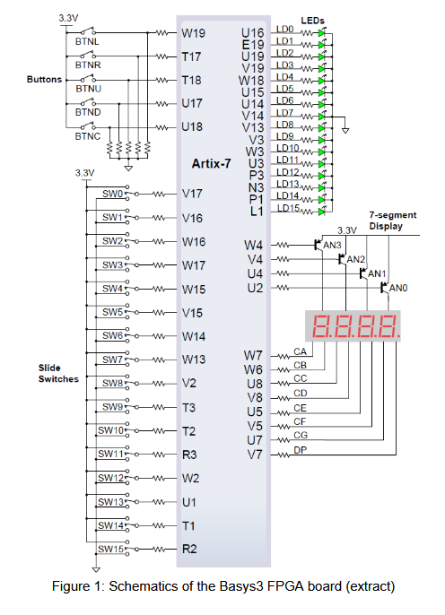
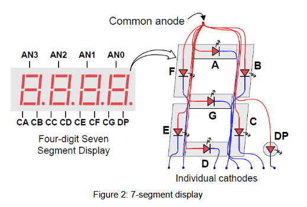

# Lecture Notes

## Specification of Counter Project

### Part 2: IO Control Unit

**Version:** BELN1.0
**Author:** R. Höller, P. Rössler

---

## Copyright Notice

This document or parts of it (text, photos, graphics and artwork) are copyrighted and not intended to be published to the broad public, e.g., over the internet. Any redistribution, publishing or broadcast with permission only. Violation may be prosecuted by law.

**German:**  
Dieses Dokument bzw. Teile davon (Text, Photos, Graphiken und Artwork) sind urheberrechtlich geschützt und nicht für die breite Veröffentlichung, beispielsweise über das Internet, vorgesehen. Jegliche weitere Veröffentlichung nur mit Genehmigung. Zuwiderhandlungen können gerichtlich verfolgt werden.

---

## Introduction

This document describes the IO control unit of the counter project. The IO control unit handles all I/O ports (except the clock and reset signal). It includes the multiplexer needed for the 7-segment digits, debounces the switches and push buttons and makes the debounced signals available for FPGA-internal logic. The IO control unit is intended to implement a generic interface which can be used for other projects too. This means, that not all IOs are actually used for the counter project (in detail, some of the switches, the LEDs and the push buttons are unused here).

---

## I/O Circuitry of Basys3 FPGA Board

Figure 1 shows an extract of the schematics of the used Digilent Basys3 FPGA development board. The 16 LEDs labeled LD0-LD15 simply need to be driven with logic 1 to switch them on.



Push buttons and switches often generate spurious open/close transitions when pressed, due to mechanical issues. These transitions may be read as multiple touches in a very short time fooling the application. Thus, the IO control unit must use a debounce mechanism for the 16 switches and 4 push buttons of the Basys3 board in order to eliminate the unwanted transitions. Note, that only the four buttons BNTL, BTNU, BTNR and BTND are handled by the IO control unit while button BTNC is used as the global asynchronous reset signal for the whole design.

The Digilent Basys3 board implements a four-digit 7-segment LED display. Eight data signals (CA, CB ... CG, DP) and four select signals (AN0-AN3) are used to control the 7-segment display. Each digit consists of eight LEDs which are connected to a common anode as well as individual cathodes. The common anode signals AN0-AN3 are used to enable the four digits. The cathodes of all four digits are connected to the eight signals labeled CA, CB, ... CG through DP. Figure 2 shows the interconnections of a single digit. To illuminate a segment, the anode needs to be driven high while the cathode must be driven low. Since the FPGA board uses transistors to supply the needed current into the common anode (see Figure 1), the anode enable signals are inverted. Therefore, both the AN0-AN3 and the CA...CG/DP signals have to be driven low when a LED shall be turned on.



A scanning display controller circuit can be used to display a four-digit number. This circuit controls the anode signals and the corresponding cathode patterns of each digit in a repetitive, continuous sequence with an update rate faster than the human eye can detect. Each digit is illuminated just one-fourth of the time, but because the eye cannot perceive the darkening of a digit before it is illuminated again, the digit appears continuously illuminated. For each digit to appear bright, a refresh frequency of 1 kHz can be used. This frequency is also suitable for debouncing the push buttons and switches.

---

## Code Skeleton of IO Control Unit

A code skeleton for the IO control unit of the counter project is shown in the following.

```vhdl
-------------------------------------------------------------------------------
--                                                                           --
-- XXXXXXXX X       XXXXXXXXX X           XXXXXXX XXXXXXX                  --
--        X X         X     X         X X       X X                      --
--        X X         X     X         X X       X X                      --
--        X X         X     X         X X       X X                      --
-- XXXXXXX XXXXXXXX   X     X XXXX XXXXXXX X     X X                      --
--        X X         X     X X    X     X X     X X                      --
--        X X         X     X X    X     X X     X X                      --
--        X X         X     X X    X     X X     X X                      --
-- XXXXXXX XXXXXXX X X XXXXXXX XXXXXXX                                   --
--                                                                           --
-- F A C H H O C H S C H U L E   -   T E C H N I K U M   W I E N           --
--                                                                           --
--                   Embedded Systems Department                             --
--                                                                           --
-------------------------------------------------------------------------------
--                                                                           --
-- Web:                  http://www.technikum-wien.at/                       --
--                                                                           --
-- Contact:              hoeller@technikum-wien.at                           --
--                                                                           --
-------------------------------------------------------------------------------
--
-- Author:             Roland Höller
--
-- Filename:           io_ctrl_.vhd
--
-- Date of Creation:   Sun Oct 20 12:14:48 2002
--
-- Version:            $Revision$
--
-- Date of Latest Version: $Date$
--
-- Design Unit:        IO Control Unit (Entity)
--
-- Description:        The IO Control unit is part of the counter project.
--                     It manages the interface to the 7-segment displays,
--                     the LEDs, the push buttons and the switches of the
--                     Digilent Basys3 FPGA board.
--
-------------------------------------------------------------------------------
--
-- CVS Change Log:
```

> A well written file header is an essential part of reusable and readable HDL Code. It is industrial practice to include entries for a version control system (in this case CVS). However, you may also use a simpler header if you like to.

```vhdl
--
-- $Log$
-------------------------------------------------------------------------------
library ieee;
use ieee.std_logic_1164.all;

entity io_ctrl is
    port (clk_i   : in std_logic;      -- 100 MHz system clock
          reset_i : in std_logic;      -- asynchronous reset
          ...);
end io_ctrl;
```

> Entity of the IO control unit. The ports clk_i, reset_i, ss_o, ss_sel_o, sw_i, pb_i and led_o are IOs of the FPGA. All other signals are connected to the counter unit (see also document “Overview of Counter Project” for a list of all entity ports).

The architecture of the IO control unit is held in a separate file:

```vhdl
-------------------------------------------------------------------------------
--                                                                           --
-- XXXXXXXX X       XXXXXXXXX X           XXXXXXX XXXXXXX                  --
--        X X         X     X         X X       X X                      --
--        X X         X     X         X X       X X                      --
--        X X         X     X         X X       X X                      --
-- XXXXXXX XXXXXXXX   X     X XXXX XXXXXXX X     X X                      --
--        X X         X     X X    X     X X     X X                      --
--        X X         X     X X    X     X X     X X                      --
--        X X         X     X X    X     X X     X X                      --
-- XXXXXXX XXXXXXX X X XXXXXXX XXXXXXX                                   --
--                                                                           --
-- F A C H H O C H S C H U L E   -   T E C H N I K U M   W I E N           --
--                                                                           --
--                   Embedded Systems Department                             --
--                                                                           --
-------------------------------------------------------------------------------
--                                                                           --
-- Web:                  http://www.technikum-wien.at/                       --
--                                                                           --
-- Contact:              hoeller@technikum-wien.at                           --
--                                                                           --
-------------------------------------------------------------------------------
--
-- Author:             Roland Höller
--
-- Filename:           io_ctrl_rtl.vhd
--
-- Date of Creation:   Sun Oct 20 12:17:48 2002
--
-- Version:            $Revision$
--
-- Date of Latest Version: $Date$
--
-- Design Unit:        IO Control Unit (Architecture)
--
-- Description:        The IO Control unit is part of the counter project.
--                     It manages the interface to the 7-segment displays,
--                     the LEDs, the push buttons and the switches of the
--                     Digilent Basys3 FPGA board.
--
-------------------------------------------------------------------------------
--
-- CVS Change Log:
--
-- $Log$

library ieee;
use ieee.std_logic_1164.all;
use ieee.std_logic_arith.all;

architecture rtl of io_ctrl is
    signal s_enctr   : std_logic_vector( downto );
    signal s_1khzen  : std_logic;
    signal swsync    : std_logic_vector( downto );
    signal pbsync    : std_logic_vector( downto );
    signal s_ss_sel  : std_logic_vector( downto );
    signal s_ss      : std_logic_vector( downto );
begin -- rtl

--
-- Generate 1 kHz enable signal.
--

p_slowen: process (clk_i, reset_i)
begin
    if reset_i = '1' then                     -- asynchronous reset (active high)
        -- reset enable and counter signals
    elsif clk_i'event and clk_i = '1' then    -- rising clock edge
        -- Enable signal is inactive per default.
        -- As long as the terminal count is not reached: increment the counter.
        -- When the terminal count is reached, set enable signal for one
        -- clock period to logic 1 and clear the counter.
    end if;
end process p_slowen;
```

> Every 1 ms, this signal will be set to a logic ‘1’ for a single 100 MHz clock period.

```vhdl
--
-- Debounce buttons and switches
--

p_debounce: process (clk_i, reset_i)
begin
    if reset_i = '1' then                   -- asynchronous reset (active high)
    elsif clk_i'event and clk_i = '1' then  -- rising clock edge
        if s_1khzen = '1' then
        end if;
    end if;
end process p_debounce;
swsync_o <= swsync;
pbsync_o <= pbsync;
```

> The registers that are used to debounce the buttons and switches are connected to the respective ports of the entity. That way, other units (in this case the counter unit) can access the registers.
>
> The switches and buttons are debounced and forwarded to FPGA-internal signals. The process makes use of the previously generated 1 kHz enable signal.

```vhdl
--
-- Display controller for the 7-segment display
--

p_display_ctrl: process (clk_i, reset_i)
begin
    if reset_i = '1' then                   -- asynchronous reset (active high)
    elsif clk_i'event and clk_i = '1' then  -- rising clock edge
        if s_1khzen = '1' then
        end if;
    end if;
end process p_display_ctrl;
ss_o <= s_ss;
ss_sel_o <= s_ss_sel;
```

> Set one of the four 7-segment select signals `s_ss_sel` to logic 0 and multiplex `cntr0_i`, `cntr1_i`, `cntr2_i` and `cntr3_i` to `s_ss` in a circular fashion using the 1 kHz enable signal.

```vhdl
-------------------------------------------------------------------------------
--
-- Handle the 16 LEDs
--
-------------------------------------------------------------------------------
led_o <= led_i; -- simply connect the internal to the external signals
end rtl;
```

---

## How to Proceed?

The next steps in the project are as follows:

* Write a VHDL entity for the IO control unit (see the previously described code skeleton), name the file, for example, “io_ctrl_.vhd” and store it in the “vhdl” sub-folder of your project directory. The entity ports can be found in the specification document “Overview of Counter Project”. Have a look at the block diagram (which is included in the specification document “Part 4: Top-Level Design”) to understand, how the IO control unit communicates with other logic in the design.
* Write a VHDL architecture for the IO control unit (see the previously described code skeleton), name the file, for example, “io_ctrl_rtl.vhd” and store it in the “vhdl” sub-folder of your project directory. Break down the functionality into smaller sub-blocks or VHDL processes (generation of 1 kHz signal, buttons & switches debouncing, display controller for the 7-segment display ... ) and decide which of these blocks need to be coded as combinatorial logic and which of them need storage elements (registers). You can also create VHDL sub-components for certain pieces of functionality but since the complexity of the IO control unit is not that high, it is rather recommended that you include everything that is described in this document in a single architecture.
* You can also create a VHDL configuration if you like to, but this is completely optional.
* Create a VHDL entity/architecture pair (and an optional configuration) for the testbench of the IO control unit, name the files, for example, “tb_io_ctrl_.vhd” and “tb_io_ctrl_sim.vhd” and store them in the “tb” sub-folder of your project directory.
* Write “do-“scripts to compile and simulate the IO control unit as described in the specification document “Introduction to ModelSim-Intel FPGA Starter Edition” and store them in the “msim” sub-folder of your project directory.
* Simulate the IO control unit using ModelSim and fix all bugs that you find.
* If the IO control unit was tested successfully, proceed with the specification document “Part 3: Counter Unit”.

---

## Version

| Version   | Minor modifications of document CHIP1 1.0 |
| :-------- | :---------------------------------------- |
| Version 1.0 |                                           |

If you find bugs or inconsistencies in this document, please report them to the course supervisors via email. Thank you!
