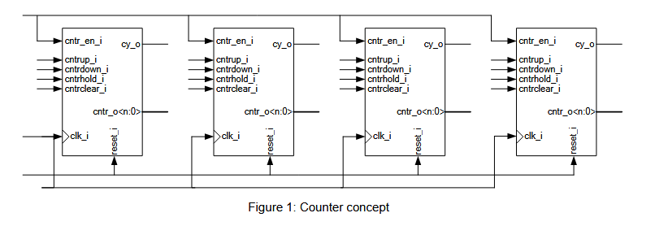

# Lecture Notes

## Specification of Counter Project

### Part 3: Counter Unit

**Version:** BELN1.0
**Author:** R. Höller, P. Rössler

---

## Copyright Notice

This document or parts of it (text, photos, graphics and artwork) are copyrighted and not intended to be published to the broad public, e.g., over the internet. Any redistribution, publishing or broadcast with permission only. Violation may be prosecuted by law.

**German:**  
Dieses Dokument bzw. Teile davon (Text, Photos, Graphiken und Artwork) sind urheberrechtlich geschützt und nicht für die breite Veröffentlichung, beispielsweise über das Internet, vorgesehen. Jegliche weitere Veröffentlichung nur mit Genehmigung. Zuwiderhandlungen können gerichtlich verfolgt werden.

---

## Introduction

This document describes the counter module of the counter project which implements the decimal, octal or hexadecimal counters, respectively.

---

## Counter Unit

Figure 1 depicts the general structure of the counter module. It is not mandatory that all four counters are implemented in separate sub-units or processes. That is, a VHDL implementation with a single process is also allowed.

*Figure 1 : Counter concept*

As described in the specification document “Overview of Counter Project”, the FPGA development board provides four 7-segment digits, each of them to be used to display a decimal (0...9), octal (0...7) or hexadecimal (0...F) number. Four bits are needed to hold the value of one digit for the decimal and the hexadecimal counter, while only three bits are needed for one digit of the octal counter (signals `cntr_o`). Note, that the decimal counter must not count from 0x0 to 0xF (0000 to 1111 in binary), but only from 0x0 to 0x9 (0000 to 1001 in binary).

Another requirement of the project is that the counting frequency of the lowest digit should be 0.5 Hz, 1 Hz, 10 Hz or 100 Hz, according to the respective project specification (see specification document “Overview of Counter Project”). Therefore, an enable signal for the four digits has to be generated out of the 100 MHz clock. Using a dedicated VHDL process is the simplest way to achieve this task (this has been already described in the previous specification document “IO Control Unit” in context of the 1 kHz enable signal).

The carry-out signals of the four counters have to arrive at the next counter stage within the same clock edge. This is necessary to achieve synchronous counting for all four digits: For example, if (in case of a decimal counter) the state of Digit 1 is 9 while the counter counts up, Digit 2 has to be incremented by one and Digit 1 has to be set to 0 at the same clock edge. Similarly, when (in case of a decimal counter) the state of Digit 1 is 0 while the counter counts down, Digit 2 has to be decremented by one and Digit 1 has to be set to 9 at the same clock edge.

Finally, the counter values shown at the signals `cntr_o(N:0)` have to be converted to an 8-bit data word to control the 7-segment displays. This, however, is done by the `io_ctrl` unit and has already been discussed in the specification document “IO Control Unit”.

---

## How to Proceed?

The next steps in the project are as follows:
*   Write a VHDL entity for the counter unit, name the file, for example, “cntr_.vhd” and store it in the “vhdl” sub-folder of your project directory. The entity ports can be found in the specification document “Overview of Counter Project”. Have a look at the block diagram (which is included in the document “Part 4: Top-Level Design”) to understand, how the counter unit communicates with other units in the design.
*   Write a VHDL architecture for the counter unit, name the file, for example, “cntr_rtl.vhd” and store it in the “vhdl” sub-folder of your project directory. Break down the functionality into smaller sub-blocks and decide which of these blocks need to be coded as combinatorial logic and which of them need storage elements (registers). You can also create VHDL sub-components for certain pieces of functionality but since the complexity of the counter unit is not that high, it is rather recommended that you include everything that is described in this document in a single architecture.
*   You can also create a VHDL configuration if you like to, but this is completely optional.
*   Create a VHDL entity/architecture pair (and an optional configuration) for the testbench of the counter unit, name the files, for example, “tb_cntr_.vhd” and “tb_cntr_sim.vhd” and store them in the “tb” sub-folder of your project directory.
*   Write “do-“scripts to compile and simulate the counter unit as described in the distance learning letter “Introduction to ModelSim-Intel FPGA Starter Edition” and store them in the “msim” sub-folder of your project directory.
*   Simulate the counter unit using ModelSim and fix all bugs that you find.
*   If the counter unit was tested successfully, proceed with the distance learning letter “Part 4: Top-Level Design”.