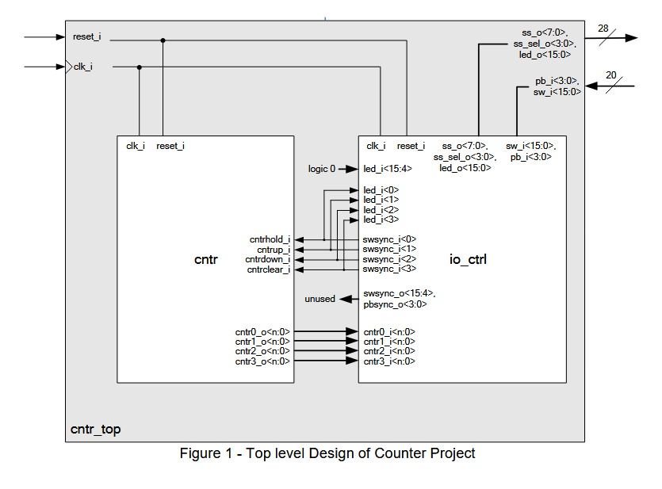
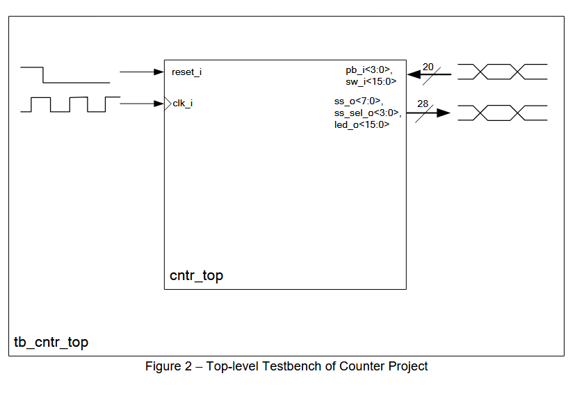

# Lecture Notes

## Specification of Counter Project

### Part 4: Top-Level Design

**Version:** BELN1.0
**Author:** R. Höller, P. Rössler

---

## Copyright Notice

This document or parts of it (text, photos, graphics and artwork) are copyrighted and not intended to be published to the broad public, e.g., over the internet. Any redistribution, publishing or broadcast with permission only. Violation may be prosecuted by law.

**German:**  
Dieses Dokument bzw. Teile davon (Text, Photos, Graphiken und Artwork) sind urheberrechtlich geschützt und nicht für die breite Veröffentlichung, beispielsweise über das Internet, vorgesehen. Jegliche weitere Veröffentlichung nur mit Genehmigung. Zuwiderhandlungen können gerichtlich verfolgt werden.

---

## Introduction

After the IO control unit and the counter unit have been coded and successfully tested in a simulation, they can be integrated into the top-level design. The top-level design is the topmost hierarchy level in the design which directly interfaces to the I/O pins of the FPGA (see the specification document “Overview of Counter Project” which includes a list of all ports of the top-level design). It is also worth having a look at the block diagram (which is shown in the following) in order to understand how the interfaces of the sub-units need to be interconnected.

---

## Interconnection of Sub-Units

The interconnections between the `io_ctrl` module and the `cntr` module are done in the `cntr_top` unit. Figure 1 shows a block diagram of this top-level module.

*Figure 1 - Top level Design of Counter Project*

Since only four LEDs are used in the counter project, the remaining inputs `led_i<15:4>` of the IO control unit can be set to static 0. Similarly, the outputs `sw_sync_o<15:4>` and `pbsync_o<3:0>` of the IO control unit are not used here. Simply connect these outputs of the IO control unit to internal signals but do not make any use of them.

---

## Testbench

The testbench of the `cntr_top` unit is used to verify the correct functionality of the hexadecimal/octal/decimal counter for the Basys3 development board. The different operating states of the counter (clear, hold, count up and count down) as well as the overflow and underflow of the four digits need precise verification. Furthermore, the functionality of the inputs and outputs (`sw_i`, `pb_i`, `ss_o`, `ss_sel_o`, `led_o`) should also be exactly tested before the design is run onto the FPGA hardware. Each functional detail defined in the project specification (see specification document “Overview of Counter Project”) should be covered by a corresponding test case.

Figure 2 illustrates the principle of the top-level testbench.

*Figure 2 – Top-level Testbench of Counter Project*

---

## How to Proceed?

The next steps in the project are as follows:

*   Write a VHDL entity for the top-level design, name the file, for example, “cntr_top_.vhd” and store it in the “vhdl” sub-folder of your project directory. The entity ports can be found in the distance learning letter “Overview of Counter Project”.
*   Write a VHDL architecture for the top-level design, name the file, for example, “cntr_top_struct.vhd” and store it in the “vhdl” sub-folder of your project directory. Have a look at the previously described block diagram in order to understand how the interfaces of the sub-units need to be wired.
*   Create a VHDL configuration if you like to, but this is completely optional.
*   Create a VHDL entity/architecture pair (and an optional configuration) for the testbench of the top-level design, name the files, for example, “tb_cntr_top_.vhd” and “tb_cntr_top_sim.vhd” and store them in the “tb” sub-folder of your project directory.
*   Write “do”-scripts to compile and simulate the top-level design as described in the document “Introduction to ModelSim-Intel FPGA Starter Edition” and store them in the “msim” sub-folder of your project directory.
*   Simulate the top-level design using ModelSim and fix all bugs that you find. The top-level simulation is the most important type of simulation since it tests the complete design! Note, that bugs may appear even if the sub-blocks have been tested thoroughly, due to an incorrect wiring of the sub-components!
*   If the top-level design was tested successfully, proceed with the last distance learning letter of the counter project named “Part 5: Synthesis & Implementation”.