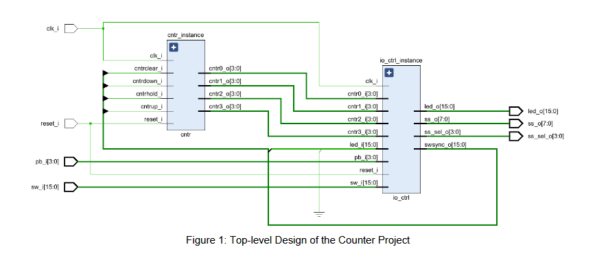
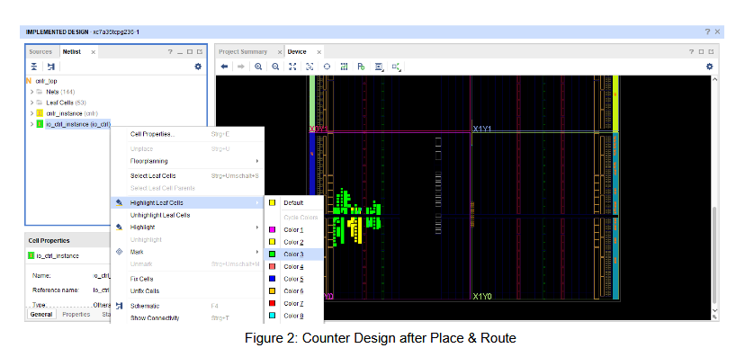
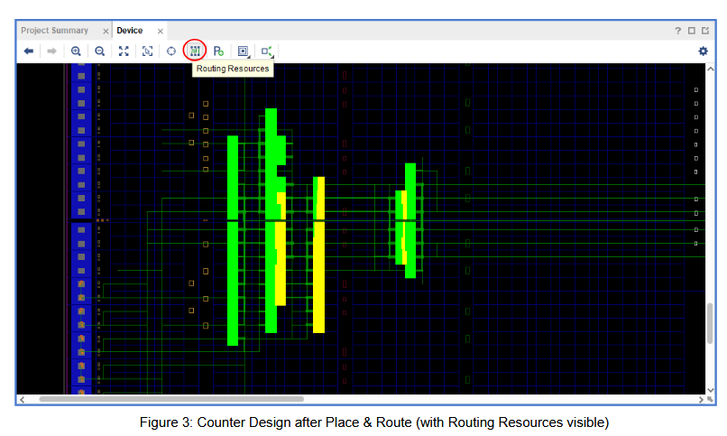
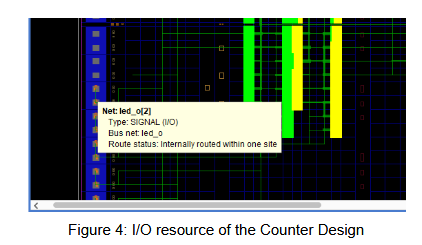
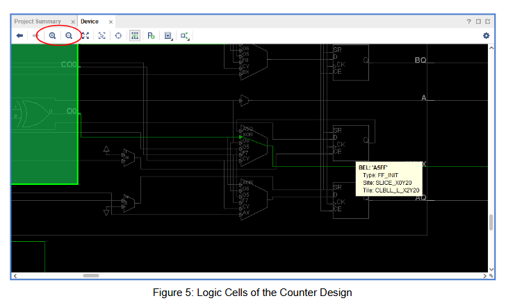

# Lecture Notes

## Specification of Counter Project

### Part 5: Synthesis & Implementation

**Version:** BELN1.0  
**Author:** R. Höller, P. Rössler

---

## Copyright Notice

This document or parts of it (text, photos, graphics and artwork) are copyrighted and not intended to be published to the broad public, e.g., over the internet. Any redistribution, publishing or broadcast with permission only. Violation may be prosecuted by law.

**German:**  
Dieses Dokument bzw. Teile davon (Text, Photos, Graphiken und Artwork) sind urheberrechtlich geschützt und nicht für die breite Veröffentlichung, beispielsweise über das Internet, vorgesehen. Jegliche weitere Veröffentlichung nur mit Genehmigung. Zuwiderhandlungen können gerichtlich verfolgt werden.

---

## Introduction

At this point we have a VHDL design of the counter project which was already successfully tested during various simulation runs, both on sub-unit level as well on the top-level. In the next step we want to implement the design on a Xilinx Artix-7 FPGA device using the already known FPGA implementation software “AMD/Xilinx Vivado”. As a final test of the counter we will run the design on the Digilent Basys3 board.

---

## Synthesis & Implementation

In order to implement the counter project on the Xilinx Artix-7 FPGA simply follow the instructions in the distance learning “Introduction to AMD/Xilinx Vivado”. The main steps are as follows:

- Create a new Vivado project in the “impl” sub-folder of the project which is named, for example, “counter”.
- Add all VHDL design files of the counter to the project (all files from the sub-folder “vhdl”) but **DO NOT** add the testbenches (files from the sub-folder “tb”).
- Choose `xc7a35tcpg236-1` as the part since this is the FPGA device that is contained on the Basys3 board.
- Run synthesis and have a look at the status messages which are classified by Vivado into three categories:  
  - **Info Messages** can be ignored.  
  - **Errors** always have to be fixed by the user since the tool cannot proceed when the cause of the error message is not found.  
  - **Warnings** may have two reasons:  
    - For the counter project you may see some warnings reporting that the signals `pb_i(3:0)` are never used in the design. However, the reason is clear since these 4 push buttons are not used for the counter. Therefore, you can ignore such kind of warnings.
    - Other warnings may indicate serious problems, for example, when the reset state of some registers is not defined (since you forgot to reset signals in the corresponding VHDL processes). This kind of warnings must be fixed by the user since there is a chance that the design will not run properly on the FPGA board. In general, have a look at all warnings and try to find out their reason. Most of the warnings are briefly explained by Vivado and also the line in the VHDL source code where the cause of the warning is expected will be shown by Vivado in most cases. If you don’t understand the warning it’s a good idea to search for it in the Internet. You should be able to explain all warnings of your design during the presentation of your project!
- Create a constraints file to define the clock frequency (100 MHz), the I/O configuration voltage as well as I/O pin assignments for all ports of the top-level design.
- Generate the FPGA bitstream. Again, have a look at all errors and warnings and try to find the reason for these messages!
- Download the generated bitstream to the FPGA and test your project on the board.

If your design does not run on the board, the most common reasons are: You (i) did not test your design thoroughly during simulation or (ii) you have ignored the Vivado warnings. Another possible source of errors is an incorrect assignment of the FPGA IO pins (thus, carefully check the IO pins as shown in the lecture notes “Introduction to AMD/Xilinx Vivado”).

Finally, we want to have a closer look in the process of synthesis and implementation, done by AMD/Xilinx Vivado.

---

### Synthesis

The logic synthesis tool transforms the RTL-level code (written in VHDL) into a gate-level netlist (i.e., a digital circuit). This transformation has to consider “constraints” which have to be met, like the desired clock frequency or the number of available logic resources in the FPGA (which are implicitly defined by the given FPGA device that was selected by the user during creation of the Vivado project). First, the VHDL code is checked for correct syntax and semantic. Status messages (info & error messages as well as warnings) are reported during the design flow. All messages are also saved to a log-file.

Modern EDA (Electronic Design Automation) tools, like AMD/Xilinx Vivado, can visualize the results of a synthesis process in a graphical way. Figure 1 shows the schematic at the top level of the counter project. This view can be activated in Vivado if you select

`RTL Analysis > Open Elaborated Design > Schematic`

from the “Flow Navigator” window (do not confuse this with “Synthesis > Open Synthesized Design > Schematic” which shows an optimized post-synthesis view of the design, instead!).

*Figure 1 : Top-level Design of the Counter Project*

Figure 1 shows that the `cntr_top` design consists of the two sub-units `io_ctrl` and `cntr`. Starting from the top-level representation of the counter, it is possible to step through the hierarchy of the design in order to see the internal circuitry of the individual sub-modules (in Vivado, select the sub units and use the arrows in the icon bar shown on top of the schematic view).

---

### Implementation (Place & Route)

As already mentioned, the synthesis tool generates an optimized gate-level netlist which consists of logic primitives (LUTs, flip-flops, I/O buffers, ...) and their interconnections (so called “nets”). The logic primitives have to be placed and routed onto the FPGA which is done in the “implementation” step. The desired clock frequency as well as the interconnections of the top-level VHDL ports to the FPGA I/O pins have to be defined by the user previously. After the design was implemented, the user can have a look at the results of the place & route designs steps. This is done by selecting

`Implementation > Open Implemented Design`

in the Vivado “Flow Navigator” window which opens another window called “Device”. The device window shows a physical representation of the design, including the FPGA logic cells and the IO pins. For example, Figure 2 shows the place & route results of the counter design. By using the “Highlight Leaf Cells” command one can highlight the logic cells of the sub-units “io_ctrl” and “cntr” in different colors (see Figure 2).

*Figure 2 : Counter Design after Place & Route*

A left-click on the “Routing Resources” icon turns on the visibility of the routing resources (see Figure 3).

*Figure 3 : Counter Design after Place & Route (with Routing Resources visible)*

If you hover over an IO pin with the mouse pointer the name of the IO pin becomes visible (see Figure 4).

*Figure 4 : I/O resource of the Counter Design*

By using the “Zoom In” icon you can have a look at each single logic cell in the FPGA device (see Figure 5).

*Figure 5 : Logic Cells of the Counter Design*

---

## Project Presentation

Congratulation! You have mastered the final project of this course! Please have a final look into the specification document “Overview of Counter Project” in order to prepare yourself for the presentation of your project (see especially the section “Project Presentation”)!
